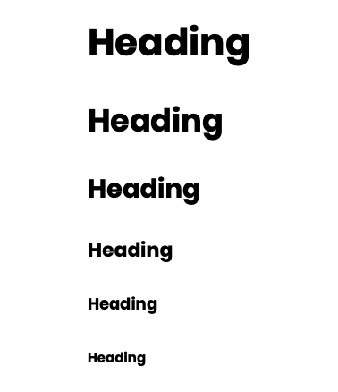
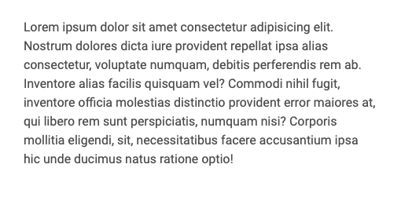
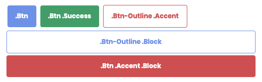
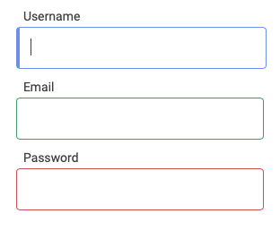
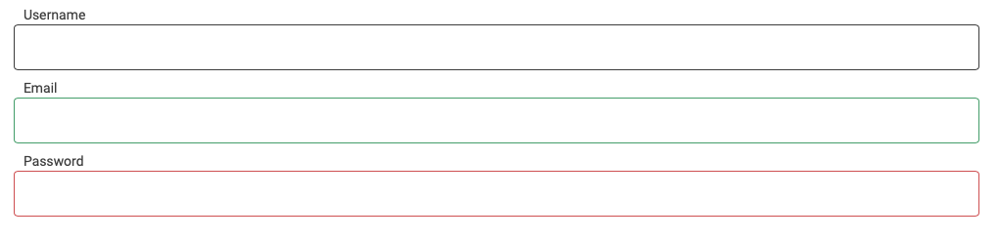
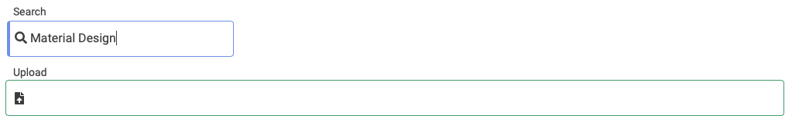

# Birch

#### An opinionated CSS framework for simple fast development ⚡️

Birch is a  CSS framework that offers a simple flex-grid for easy layout with classes like small , large and half. It also provides simple fluid abstractions for the most common HTML elements. 

**Note : Work in Progress 🌻**

# Installation
`cd` into your Project Directory.

**Clone the repo**

`git clone https://github.com/ARitik/Birch.git`

Add the following code to the HTML file just before the ending of `</head>`
```HTML
 <link rel="stylesheet" href="birch.css">
```
Birch has some additional styling that makes using Font Awesome Icons with Buttons and Form-inputs very easy.
```HTML
<!DOCTYPE html>
<html lang="en">
<head>
    <meta charset="UTF-8">
    <meta name="viewport" content="width=device-width, initial-scale=1.0">
    <title>Document</title>
    <link rel="stylesheet" href="birch.css">
</head>
```

# Grid
Birch contains a simple flex-grid with a mobile-first approach. It breaks at large sizes and ignores medium screen sizes. The breakpoint is set at 800px for mobile.


```html
 <div class="container">
        <div class="row">
            <div class="col half">.half</div>
            <div class="col half">.half</div>
        </div>
        <div class="row">
            <div class="col small">.small</div>
            <div class="col small">.small</div>
            <div class="col half">.half</div>
        </div>
        <div class="row">
            <div class="col large">.large</div>
            <div class="col small">.small</div>
        </div>
    </div>
```
#### Container
This is the parent container and can be used with a `main` tag for semantic purposes.
Add a `.flex` class to a container if you want the container to take the full-width of the page.

#### Rows
Use `.row` to define a horizontal space where your columns `.col` can be placed. Define rows with sections for semantic purposes. Rows take up the full-width of their parent container.

#### Columns
Use `.col` to divide a `.row` into spaces. Adding `.col` into a row without additional classes will auto-fill the row and assign each `.col` with an equal space.
However to leverage the Grid use the following three classes.

1.  small
2.  large
3.  half

`.small` class takes up a quarter of the total row. (25%)
`.large` class takes up three-quarters (3/4) of the total row. (75%)
`.half` class takes up half of the total row. (50%)

# Typography
**Headings : Poppins**
**Paragraphs : Roboto**



Use the `.primary` `.accent` `.success` classes for different coloured headings and paragraphs.



# Buttons

Birch provides two types of buttons.
1. Outlined buttons 
2. Standard buttons



By default , text inside buttons are set to `text-transform : capitalize;`
Button font used is Poppins with `font-weight:bold;`

```HTML
<button class="btn">.btn</button>
<button class="btn success">.btn .success</button>
<button class="btn-outline accent">.btn-outline .accent</button>
<button class="btn-outline block">.btn-outline .block</button>
<button class="btn accent block">.btn .accent .block</button>
```
#### Button Types
Buttons without classes have standard stying applied to them. 

Use the `.btn` class to have color-filled standard buttons.

Use the `.btn-outline` class to have outlined colour buttons.

#### Button Colours
`.btn` and `.btn-outline` come with the primary colour as a standard.
To change the colour of the buttons , use `.accent` or `.success`

```HTML 
<button class="btn success">Submit</button>
```
#### Block level Buttons
Use the `.block` class for a block level button.

```HTML
<button class="btn block">Login</button>
```

#### Font-awesome Icons with Buttons
Font-awesome icons support without any additional CSS!

Just add the desired font-awesome icon with an `<i>` tag or a `<span>` tag inside the Button.


```HTML
<button class="btn success">Search<i class="fas fa-search"></i></button>
<button class="btn-outline accent">Delete<i class="fas fa-trash-alt"></i></button>
```
# Form Inputs
Birch provides standard styling with input tags and labels.




```HTML
    <label for="user">Username</label>
    <input type="text" name="user">

    <label for="email">Email</label>
    <input class="success" type="email" name="email">

    <label for="password">Password</label>
    <input class="error" type="password" name="password">
```
The `.error` class applies a blink effect animation when applied.

#### Form-validation
Use the  `.success` and `.error` classes for form validation.

#### Full-width forms
Use the `.block` for a full-width block-level form.



```HTML

    <label for="user">Username</label>
    <input class="block" type="text" name="user">

    <label for="email">Email</label>
    <input class="success block" type="email" name="email">

    <label for="password">Password</label>
    <input class="error block" type="password" name="password">
```

#### Font-awesome icons with Form inputs
Wrap the form-input with labels you want to add Font-awesome icons to with a `.form-wrapper` class. 

Add the desired Font-awesome icon with an `<i>` or a `<span>` tag.



```HTML

    <div class="form-wrapper">
      <label for="search">Search</label>
      <i class="fas fa-search"></i>
      <input type="text" name="search">
    </div>
    <div class="form-wrapper">
      <label for="upload">Upload</label>
      <i class="fas fa-file-upload"></i>
      <input class="success block" type="email" name="upload">
    </div>


```