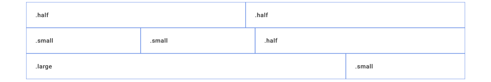

# Birch

#### An opinionated CSS framework for simple fast development ⚡️

Birch is a simple CSS framework that offers a simple flex-grid for easy layout with easy classes like small , large and half. It also provides simple fluid abstractions for the most common HTML elements. 

**Note : Work in Progress 🌻**

# Grid
Birch contains a simple flex-grid with a mobile-first approach. It breaks at large sizes and ignores medium screen sizes. The breakpoint is set at 800px for mobile.



```html
 <div class="container">
        <div class="row">
            <div class="col half">.half</div>
            <div class="col half">.half</div>
        </div>
        <div class="row">
            <div class="col small">.small</div>
            <div class="col small">.small</div>
            <div class="col half">.half</div>
        </div>
        <div class="row">
            <div class="col large">.large</div>
            <div class="col small">.small</div>
        </div>
    </div>
```
#### Container
This is the parent container and can be used with a `main` tag for semantic purposes.
Add a `.flex` class to a container if you want the container to take the full-width of the page.

#### Rows
Use `.row` to define a horizontal space where your columns `.col` can be placed. Define rows with sections for semantic purposes. Rows take up the full-width of their parent container.

#### Columns
Use `.col` to divide a `.row` into spaces. Adding `.col` into a row without additional classes will auto-fill the row and assign each `.col` with an equal space.
However to leverage the Grid use the following three classes.

1.  small
2.  large
3.  half

`.small` class takes up a quarter of the total row. (25%)
`.large` class takes up three-quarters (3/4) of the total row. (75%)
`.half` class takes up half of the total row. (50%)
